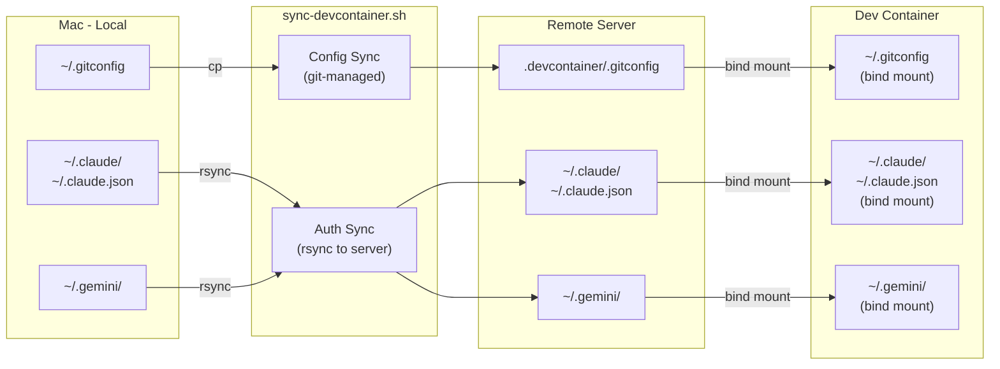
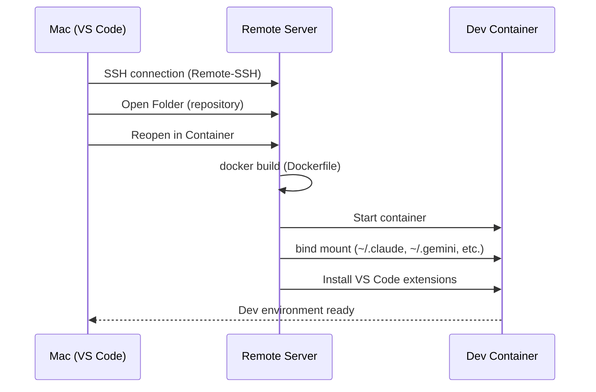

# Server Setup Guide

Remote server (SSH) environment setup guide for devcontainer.

## Prerequisites

- Mac (local machine) with the following configured:
  - Git (`~/.gitconfig`)
  - Claude Code (`~/.claude/`, `~/.claude.json`)
  - Gemini CLI (`~/.gemini/`)
- Remote server with SSH access
- `rsync` installed on both local and remote machines

## Architecture



## File Management

| File             | Method      | Mount Source               | Contains Secrets |
| ---------------- | ----------- | -------------------------- | :--------------: |
| `.gitconfig`     | git-managed | `.devcontainer/.gitconfig` |        No        |
| `.zshrc`         | git-managed | `.devcontainer/.zshrc`     |        No        |
| `~/.claude/`     | rsync       | Server `~/.claude/`        |       Yes        |
| `~/.claude.json` | rsync       | Server `~/.claude.json`    |       Yes        |
| `~/.gemini/`     | rsync       | Server `~/.gemini/`        |       Yes        |

## Setup Steps

### 1. Sync config files (from Mac)

```bash
./scripts/sync-devcontainer.sh
```

This copies `~/.gitconfig` to `.devcontainer/.gitconfig` (git-tracked, no secrets).

### 2. Sync auth files to server (from Mac)

```bash
./scripts/sync-devcontainer.sh your-server-name
```

This additionally syncs authentication files to the remote server via rsync:

- `~/.claude/` and `~/.claude.json` (Claude Code auth)
- `~/.gemini/` (Gemini CLI auth)

### 3. Open devcontainer on server

#### 3-1. Server prerequisites

Verify the following are available on the remote server:

```bash
ssh your-server-name

# Docker
docker --version        # Docker Engine 20.10+
docker compose version  # Docker Compose v2+

# Git
git --version
```

#### 3-2. Clone the repository on server

```bash
ssh your-server-name
git clone https://github.com/tkm5/devcontainer-env.git
cd devcontainer-env
```

#### 3-3. Verify synced files on server

Confirm that the files synced in Step 2 are correctly placed on the server:

```bash
# Claude Code auth
ls -la ~/.claude/
ls -la ~/.claude.json

# Gemini CLI auth
ls -la ~/.gemini/

# Git config (in the cloned repo)
cat .devcontainer/.gitconfig
```

If any of these are missing, re-run Step 2 from Mac:

```bash
./scripts/sync-devcontainer.sh your-server-name
```

#### 3-4. Configure SSH connection

Ensure the server is configured in `~/.ssh/config` on your Mac:

```
Host your-server-name
    HostName 192.168.x.x
    User your-username
    IdentityFile ~/.ssh/id_ed25519
```

Verify the connection:

```bash
ssh your-server-name "echo 'Connection successful'"
```

#### 3-5. Connect to server via VS Code

1. Open VS Code
2. Open the command palette with `Cmd + Shift + P`
3. Select `Remote-SSH: Connect to Host...`
4. Select `your-server-name` (the host name registered in SSH config)
5. A new VS Code window opens, connected to the server

#### 3-6. Open project in devcontainer

1. In the server-connected VS Code, select `File > Open Folder...`
2. Open the cloned repository path (e.g., `/home/your-username/devcontainer-env`)
3. Click the `Reopen in Container` notification that appears in the bottom-right corner
   - If the notification does not appear: `Cmd + Shift + P` -> `Dev Containers: Reopen in Container`
4. The container build runs on the first launch (this may take a few minutes)



#### 3-7. Verify the devcontainer

Once the container is running, open a terminal in VS Code (`` Ctrl + ` ``) and verify:

```bash
# User
whoami                  # => devcontainer

# Shell
echo $SHELL             # => /bin/zsh

# Git config
git config user.name    # => Your configured name
git config user.email   # => Your configured email

# Dev tools
node --version          # => v24.13.0
uv --version            # => 0.9.28
gh --version            # => GitHub CLI

# AI tools
claude --version        # => Claude Code
gemini --version        # => Gemini CLI
```

If all commands return the expected output, the setup is complete.

## Re-syncing

When authentication tokens expire or config changes:

```bash
# Config only (e.g., after editing ~/.gitconfig)
./scripts/sync-devcontainer.sh

# Config + auth (e.g., after re-authenticating Claude Code)
./scripts/sync-devcontainer.sh your-server-name
```

After syncing, rebuild the devcontainer to pick up changes.

## Troubleshooting

### Container fails to start with mount error

Ensure the required files exist on the server:

```bash
ssh your-server-name "mkdir -p ~/.claude ~/.gemini && touch ~/.claude.json"
```

Or re-run the sync script:

```bash
./scripts/sync-devcontainer.sh your-server-name
```

### Git identity not recognized in container

Verify `.devcontainer/.gitconfig` exists and contains correct settings:

```bash
cat .devcontainer/.gitconfig
```

If empty, re-run the sync script on Mac:

```bash
./scripts/sync-devcontainer.sh
```
