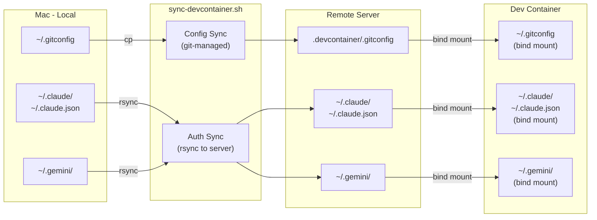

# Server Setup Guide

Remote server (SSH) environment setup guide for devcontainer.

## Prerequisites

- Mac (local machine) with the following configured:
  - Git (`~/.gitconfig`)
  - Claude Code (`~/.claude/`, `~/.claude.json`)
  - Gemini CLI (`~/.gemini/`)
- Remote server with SSH access
- `rsync` installed on both local and remote machines

## Architecture



## File Management

| File | Method | Mount Source | Contains Secrets |
|------|--------|-------------|:---:|
| `.gitconfig` | git-managed | `.devcontainer/.gitconfig` | No |
| `.zshrc` | git-managed | `.devcontainer/.zshrc` | No |
| `~/.claude/` | rsync | Server `~/.claude/` | Yes |
| `~/.claude.json` | rsync | Server `~/.claude.json` | Yes |
| `~/.gemini/` | rsync | Server `~/.gemini/` | Yes |

## Setup Steps

### 1. Sync config files (from Mac)

```bash
./scripts/sync-devcontainer.sh
```

This copies `~/.gitconfig` to `.devcontainer/.gitconfig` (git-tracked, no secrets).

### 2. Sync auth files to server (from Mac)

```bash
./scripts/sync-devcontainer.sh your-server-name
```

This additionally syncs authentication files to the remote server via rsync:
- `~/.claude/` and `~/.claude.json` (Claude Code auth)
- `~/.gemini/` (Gemini CLI auth)

### 3. Open devcontainer on server

Connect to the server via VS Code Remote SSH, then open the project in a devcontainer.
Ensure the required files and directories (`~/.claude/`, `~/.gemini/`, `~/.claude.json`) exist on the server before container creation (the sync script in step 2 handles this).

## Re-syncing

When authentication tokens expire or config changes:

```bash
# Config only (e.g., after editing ~/.gitconfig)
./scripts/sync-devcontainer.sh

# Config + auth (e.g., after re-authenticating Claude Code)
./scripts/sync-devcontainer.sh your-server-name
```

After syncing, rebuild the devcontainer to pick up changes.

## Troubleshooting

### Container fails to start with mount error

Ensure the required files exist on the server:

```bash
ssh your-server-name "mkdir -p ~/.claude ~/.gemini && touch ~/.claude.json"
```

Or re-run the sync script:

```bash
./scripts/sync-devcontainer.sh your-server-name
```

### Git identity not recognized in container

Verify `.devcontainer/.gitconfig` exists and contains correct settings:

```bash
cat .devcontainer/.gitconfig
```

If empty, re-run the sync script on Mac:

```bash
./scripts/sync-devcontainer.sh
```
